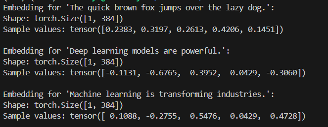
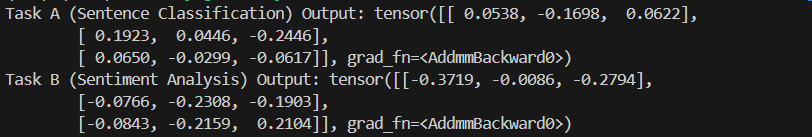
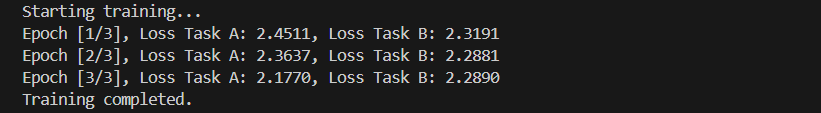
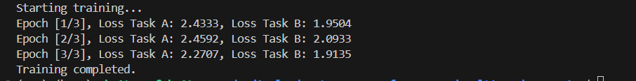

# Sentence Transformers and Multi-Task Learning

##  📖 Project Overview

This project explores sentence transformers in a multi-task setup. It includes tasks like encoding sentences into fixed-length embeddings, classifying sentences, examining the effects of freezing different model layers during training, and using layer-specific learning rates to improve performance.

---
## 📂 Project Layout

```plaintext
/project-root
├── README.md               # Project documentation
├── Dockerfile              # Docker setup
├── requirements.txt        # Project dependencies
├── /src                    # Source code for each task
│   ├── task1_transformer.py       # Task 1: Sentence Embeddings
│   ├── task2_multitask_model.py   # Task 2: Multi-Task Model
│   ├── task3_train.py             # Task 3: Training with Freezing
│   └── task4_layerwise_lr.py      # Task 4: Layer-Specific Learning Rates
```
---
## Project Layout
## ⚙️ Setup Guide

### 🐳 Running with Docker

1. **Build the Docker Image**:
   ```sh
   docker build -t multi_task_transformer .
   ```
2. **Run the Container: To run the default task (Task 4):**:
   ```sh
   docker run --rm multi_task_transformer
   ```
3. **Running a Specific Task: Use the command below to run a specific task (e.g., Task 3):**:
   ```sh
   docker run --rm multi_task_transformer python /app/src/task3_train.py
   ```

### 📝 Manual Setup (without Docker)

1. **Create a Virtual Environment:**:
   ```sh
   python -m venv env
   source env/bin/activate  # Use `env\Scripts\activate` on Windows
   ```
2. **Install Required Packages:**:
   ```sh
   pip install -r requirements.txt
   ```
3. **Running Each Task: Use the following commands to run each task manually:**:
   ```sh
   python src/task1_transformer.py  # Task 1
   python src/task2_multitask_model.py  # Task 2
   python src/task3_train.py  # Task 3
   python src/task4_layerwise_lr.py  # Task 4
   ```
---
## 🧩 Task Descriptions and How to Run Each


### Task 1: Sentence Transformer Implementation

- **Purpose:** Generate contextually aware sentence embeddings for downstream NLP tasks.

- **Command:**
    ```sh
    docker run --rm multi_task_transformer python /app/src/task1_transformer.py
    ```

- **Expected Output:** Contextual embeddings for each sample sentence.

- **Summary:**  
    - This task uses a pretrained transformer model with mean pooling to obtain efficient, fixed-length embeddings.
    - **Model Choice:** `sentence-transformers/all-MiniLM-L6-v2` was selected for its balance of speed and accuracy.
    - **Pooling Method:** Mean pooling offers simplicity without sacrificing contextual information, making it suitable for varied NLP tasks.

- **Key Decisions:**
    - **Efficiency:** Mean pooling avoids extra computational layers, aligning with the task’s performance goals.
    - **Clarity:** This approach is straightforward, making it reproducible and accessible for a variety of tasks and models.

- **Output:** Each sentence produces a fixed-length embedding of shape [1, 384]. 
    Below is a sample output showing the shape and example values:

    

---
### Task 2: Multi-Task Learning Expansion

- **Purpose:**  Set up a multi-task model with heads for sentence classification and sentiment analysis.

- **Command:**
    ```sh
    docker run --rm multi_task_transformer python /app/src/task2_multitask_model.py
    ```
- **Objective**: Implement a multi-task transformer model with two task-specific heads:
    - **Task A (Sentence Classification):** Classifies sentences into predefined classes.
    - **Task B (Sentiment Analysis):** Analyzes the sentiment (e.g., positive, neutral, negative).

- **Model Structure**:
    - **Encoder Backbone:** The model uses a pretrained encoder (`sentence-transformers/all-MiniLM-L6-v2`) for generating sentence embeddings.
    - **Mean Pooling:**A mean pooling layer reduces embeddings to a fixed-length representation.
    - Two separate linear heads (`classification_head` and `sentiment_head`) provide output for each task, enabling the model to learn distinct representations for each task.

- **Key Design Decisions**:
    - **Separate Heads**: Each task head allows the model to specialize in distinct outputs for classification and sentiment analysis, enhancing flexibility and accuracy.
    - **Mean Pooling**: This strategy balances efficiency and simplicity in sentence encoding without additional layers.

- **Testing & Output Summary**:
    The output for each task shows that the model successfully gives unique predictions for both sentence classification and sentiment analysis, with consistent shapes and clear differences in results across tasks.

    

---
### Task 3: Training with Freezing Layers

- **Purpose:** Train a multi-task model that can handle both sentence classification and sentiment analysis effectively.

- **Command:**
    ```sh
    docker run --rm multi_task_transformer python /app/src/task3_train.py
    ```
### Steps and Code Summary: 

1.   **Model Initialization:** `initialize_model()` loads a pre-trained sentence transformer `(sentence-transformers/all-MiniLM-L6-v2)` and sets up a multi-task model with two heads—one for sentence classification and another for sentiment analysis.

2.  **Loss Function and Optimizer:** 

    **Loss:** Cross-entropy loss is applied to both tasks, which is suitable for multi-class classification.

    **Optimizer:** The Adam optimizer, with a learning rate of 1×10^(-4), is used to update the model parameters.


3.  **Training Loop:** 
    `The train_model()` function iterates through data batches, where the model:
    1. Produces predictions for both tasks.
    2. Calculates individual losses, combines them, and optimizes the model.
    3. Runs for three epochs, with loss values displayed at each epoch’s end to track progress.

4. **Data Loader Setup:**  A simple DataLoader with dummy data is used to demonstrate the model’s capability for multi-task training, which can be replaced by real datasets.

- **Output Observations:**



The steady decrease in losses shows that the model is learning effectively, though results will vary with different data.

- **Key Design Choices**

    - **Separate Losses for Each Task:** Using individual losses for each task helps the model optimize independently for both sentence classification and sentiment analysis.

    - **Shared Transformer Encoder:** By sharing the encoder, the model can efficiently handle both tasks, while task-specific heads refine the outputs for each one.

- **Additional Training Strategies:**

    - **Freezing Scenarios:**
    
    1. Entire Network Frozen: Using the transformer only as a feature extractor; fast but less adaptable for specific tasks.
    2. Only Transformer Frozen: Allows task heads to adapt without modifying the general language model, which can reduce overfitting.
    3. One Task Head Frozen: Useful if one task is well-trained; focuses resources on improving the other task.

    - **Transfer Learning Approach:**

    1. Pre-trained Model: The sentence-transformers/all-MiniLM-L6-v2 model provides strong baseline embeddings.
    2. Layer Freezing Choices: Freezing the backbone and training only the heads can improve task-specific accuracy while keeping core language understanding intact.
    3. Rationale: Transfer learning allows us to start with robust language knowledge, making training faster and more effective, especially with limited data.

---

### Task 4: Layer-Specific Learning Rates 

- **Purpose:**  To improve model training by setting different learning rates for specific layers, letting each part of the model adapt at its own pace.

- **Command:**
    ```sh
    docker run --rm multi_task_transformer
    ```

- **Objective:** 

    We used varying learning rates for:

     - **Embedding layers** (`encoder.embeddings`): 1e-6, to keep core language features steady.
     - **Encoder layers** (`encoder.encoder.layer`): 1e-5, allowing these layers to adapt gradually.
     - **Task-specific heads** (`classification_head` and `sentiment_head`): 1e-4, the highest rate so these parts can quickly specialize for each task.

- **Why Different Rates?**

    Using lower rates for foundational layers helps preserve their general language understanding. Higher rates for task-specific heads help these layers quickly focus on the unique requirements of each task, like sentiment analysis or classification.

- **How It Works:**

    We grouped model parameters by layer and assigned each group its own learning rate.
    The optimizer, torch.optim.Adam, then adjusts each layer according to these rates during training.


- **Output:**  The loss values decreased across epochs, which shows that the model is learning effectively:

    

- **Benefits of Layer-wise Learning Rates in This Multi-Task Setting:**

    This approach keeps the core language knowledge stable, while letting task-specific heads adjust faster. In a multi-task model, this balance helps improve training efficiency and accuracy.

- **Conclusion:** 

    Using layer-wise learning rates allowed the model to fine-tune more effectively, making it both stable and adaptable to each task.

---
## 🔍 Method Selection Rationale

In developing this multi-task transformer model, I explored several different approaches before settling on the final choices. Here’s a rundown of some alternative methods I considered, along with the reasons they weren’t selected:

### 1. **Alternative Pooling Methods (e.g., Max Pooling, Attention Pooling)**
While max pooling and attention pooling can capture specific nuances, they also add complexity and require extra tuning, which wasn’t necessary for this use case. Mean pooling provided a reliable way to get fixed-length embeddings without the extra setup.

### 2. **Separate Encoder Models for Each Task**
Using a shared encoder allowed general features to benefit both tasks while saving resources.

### 3. **Fully Fine-Tuned Model**
Freezing certain layers struck a balance between retaining pre-trained knowledge and adapting to specific tasks, avoiding overfitting.

### 4. **Uniform Learning Rate for All Layers**
Layer-wise learning rates offered flexibility, helping foundational layers retain general knowledge and task-specific layers adapt faster.

---
## 🏁 Final Notes
- **Testing:** Each task has been tested in Docker to make sure everything works as expected.
- **Efficiency:** The model is designed to be efficient, with minimal additional layers and thoughtful use of layer-specific learning rates.